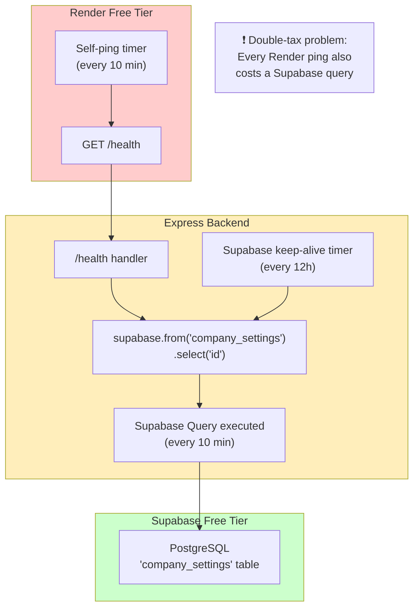
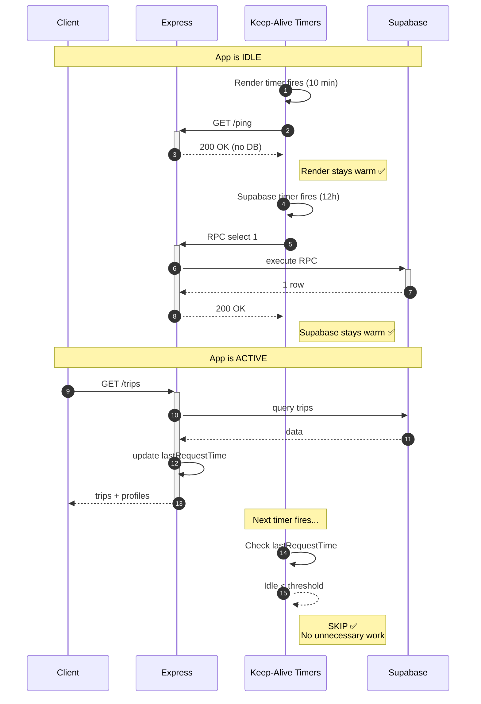

# Keep-Alive Architecture Diagrams

## Current State (The Problem)



---

## Proposed State (The Solution)

```mermaid
flowchart TD
    subgraph Request["Incoming Request"]
        direction LR
        REQ["Any API call<br/>(trips, orders, pricing)"] --> T["Update<br/>lastRequestTime"]
    end

    subgraph Render_Keepalive["Render Keep-Alive"]
        direction TB
        RT["Timer fires<br/>(every 10 min)"] --> RC{Idle > 10 min?}
        RC -->|Yes| RP["GET /ping"]
        RC -->|No <br/>(app active)| SKIP[" SKIP ✅"]
        RP --> R200["Return 200<br/>(no DB touch)"]
    end

    subgraph Supabase_Keepalive["Supabase Keep-Alive"]
        direction TB
        ST["Timer fires<br/>(every 12h)"] --> SC{Idle > 12h?}
        SC -->|Yes| SQ["Cheapest query:<br/>RPC select 1"]
        SC -->|No <br/>(recent traffic)| SUPSKIP[" SKIP ✅"]
        SQ --> SB["Supabase ping"]
    end

    T -.->|updates| RTIMER["shared lastRequestTime"]
    T -.->|updates| STIMER["shared lastRequestTime"]
    RTIMER -.-> RC
    STIMER -.-> SC

    style Request fill:#e1f5fe
    style Render_Keepalive fill:#ffcccc
    style Supabase_Keepalive fill:#ccffcc
```

---

## Request Lifecycle (Traffic-Aware Detail)



---

## Key Changes Summary

| Component | Before | After |
|-----------|--------|-------|
| **Render ping** | `GET /health` (hits DB) | `GET /ping` (static 200) |
| **Render frequency** | Every 10 min (unconditional) | Every 10 min (only if idle) |
| **Supabase query** | `company_settings` select | RPC `select 1` (cheapest) |
| **Supabase frequency** | Every 12 h (unconditional) | Every 12 h (only if idle) |
| **Shared state** | None | `lastRequestTime` timestamp |

---

## Rate Math (Before vs After)

| Scenario | Render pings/day | Supabase queries/day | Notes |
|----------|------------------|----------------------|-------|
| **Before** (idle) | 144 | 144 + 2 = **146** | Every Render ping also hits Supabase |
| **Before** (active 8h) | 144 | 144 + 2 = **146** | No reduction during active hours |
| **After** (idle) | 144 | **2** | Only Supabase 12h timer fires |
| **After** (active 8h) | **~0** | **~0** | Traffic-aware skip saves everything |

> **Result**: During an 8-hour active day, both keep-alive systems reduce to near-zero work.
